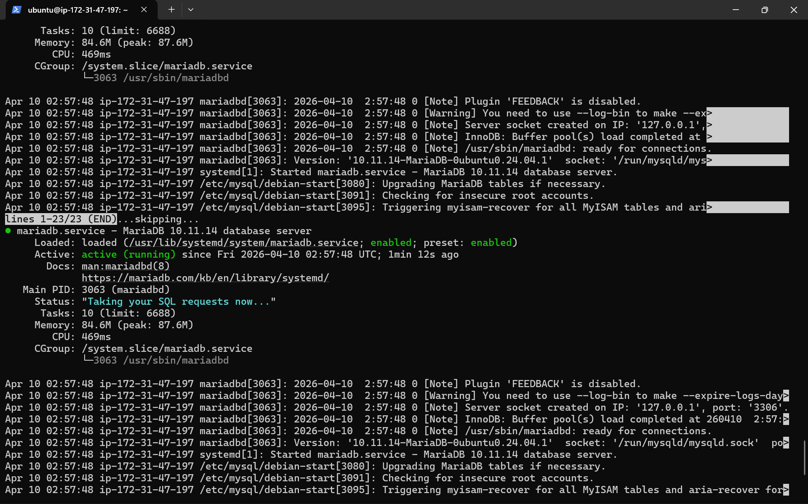
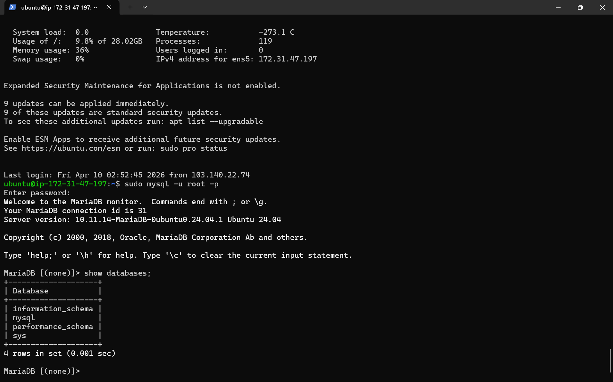
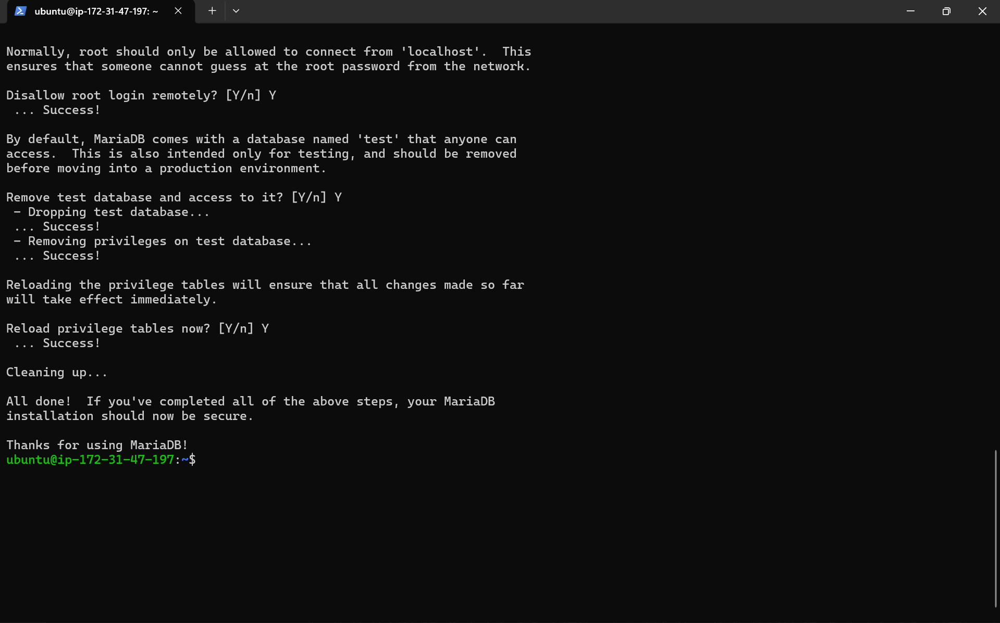
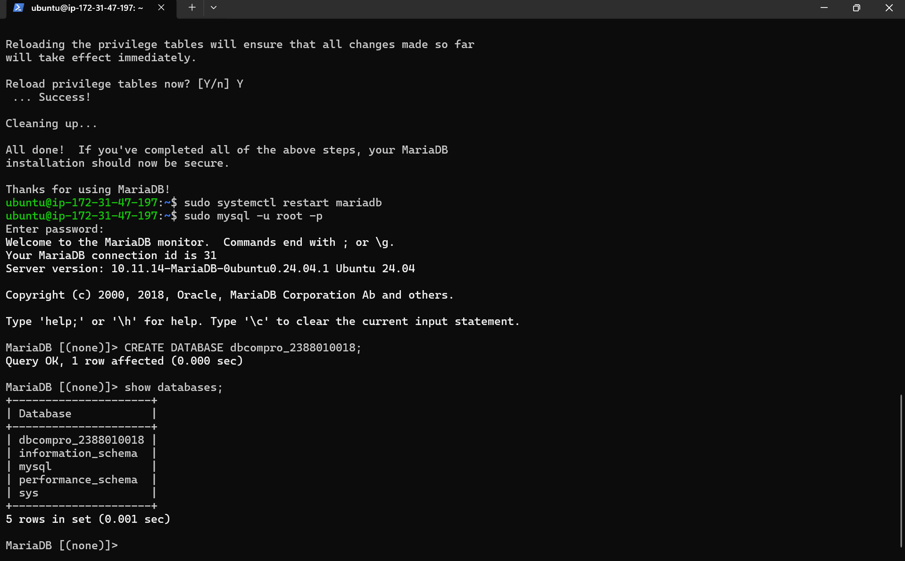
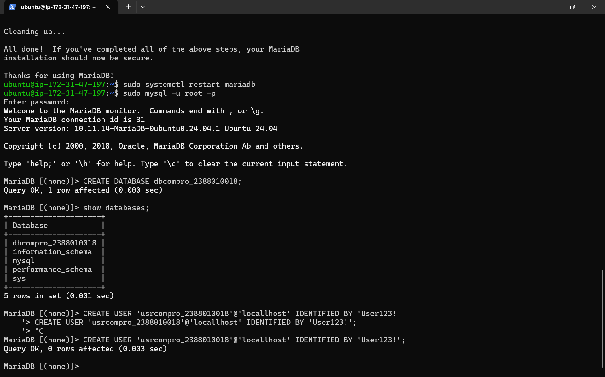
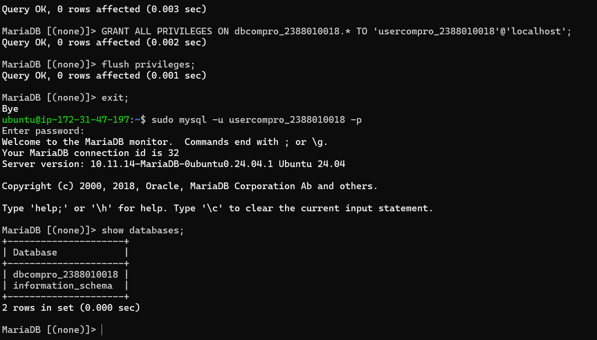

# Setting up databse di AWS Ec2 Menggunakana mariaDB
1. aktifkan instance AWS Ec2
2. remote via open ssh powershell / putty "ssh -i Nama_key.pem ubuntu@ip_address"
3. Patching OS (sudo apt-get update && sudo apt-get upgrade)
4. install maria DB "sudo apt install mariadb-server -y"
5. cek status mariaDB "systemctl status mariadb"

6. test defauld setting database server login 
sudo mysql -u root -p

7. Hardening Database Server sudo mysql_secure_installation Change the password for the root user = Y Remove anonymous users = Y Disallow root login remotely = Y Remove test database and access to it = Y Reload privilege

8. create db untuk website company profile
- "sudo apt systemctl restart mariadb"
- login sebagai root. masukan password yg sudah di bikin tadi

9. Create User dengan nama = dbcompro_NIM dan password = [PASSWORD] => CREATE USER 'dbcompro_NIM'@'localhost' IDENTIFIED BY '[PASSWORD]';

10. Grant user akses ke DB yang baru dibuat => GRANT ALL PRIVILEGES ON dbcompro_NIM.* TO 'usrcompro_NIM'@'localhost';
Flush privileges => FLUSH PRIVILEGES;
exit;
login sebagai usrcompro_NIM dan cek apakah bisa akses ke DB yang baru dibuat
