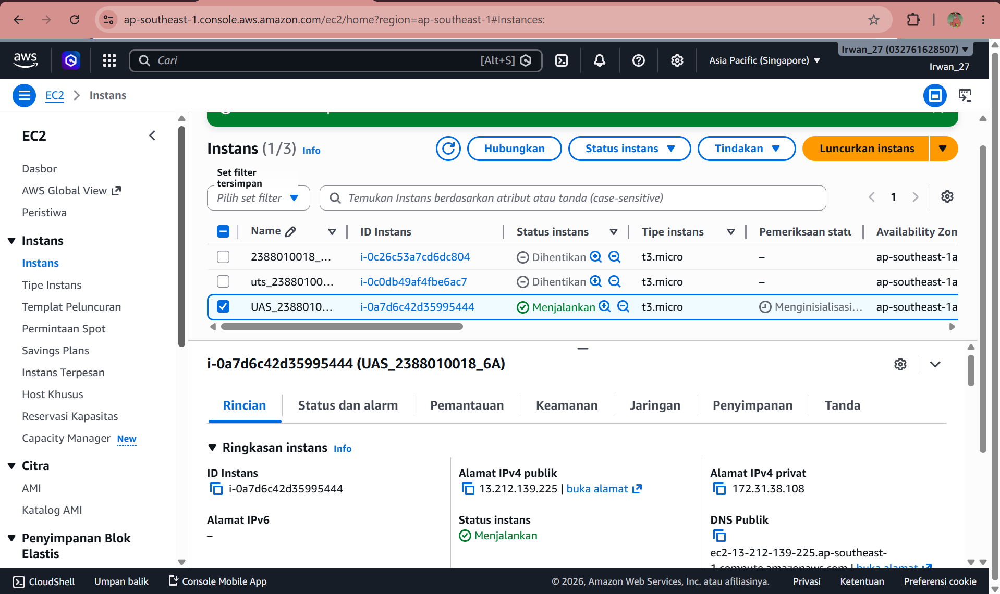
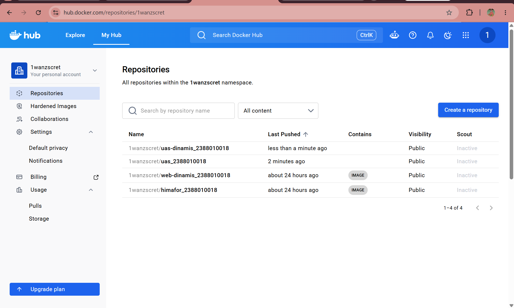
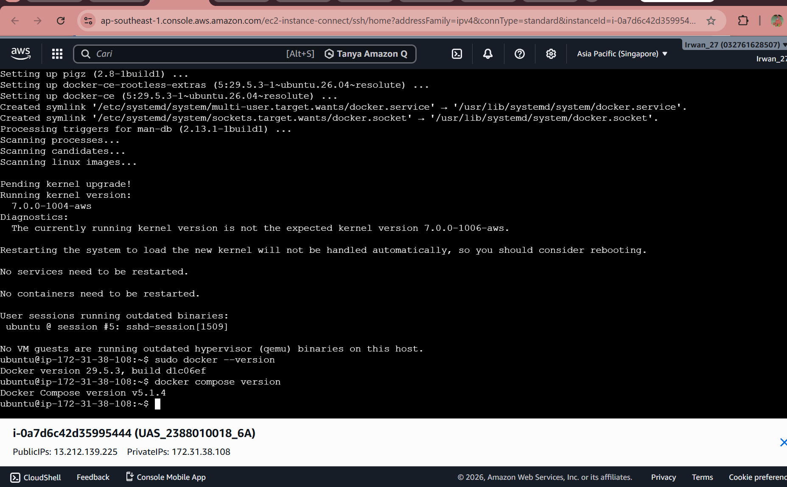
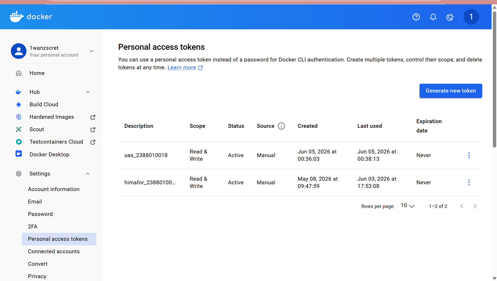
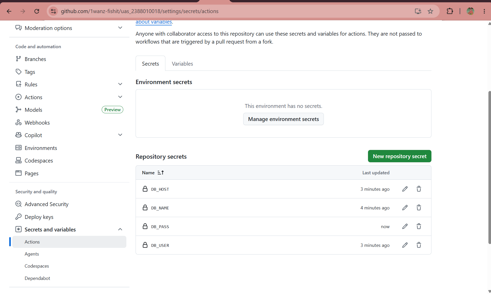
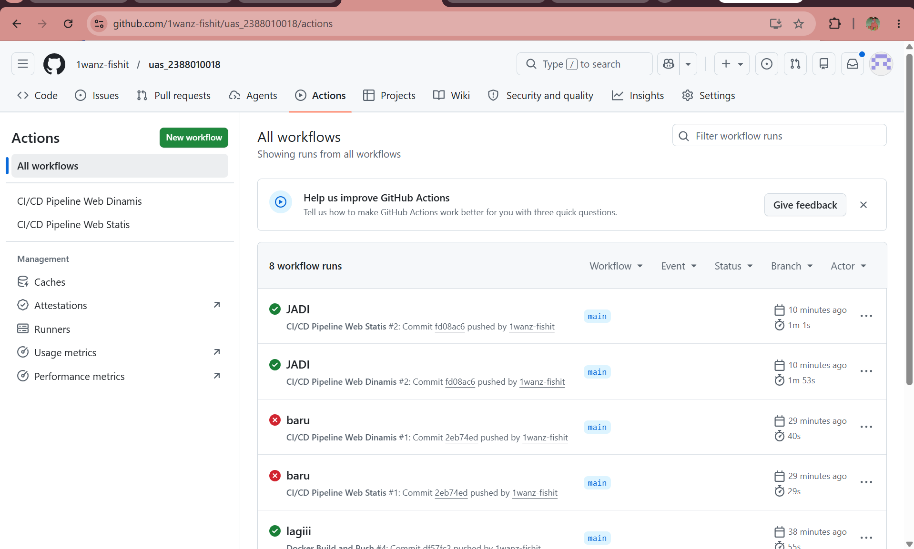
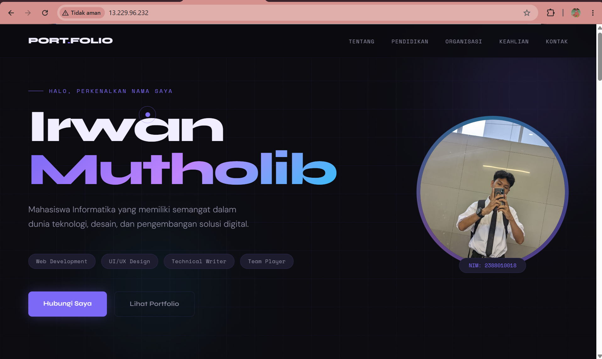
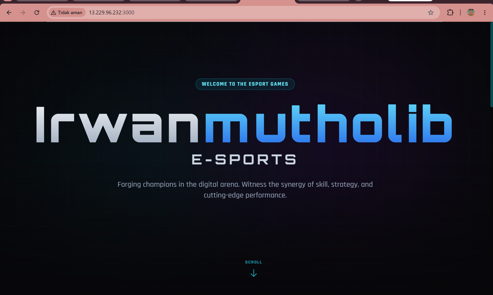
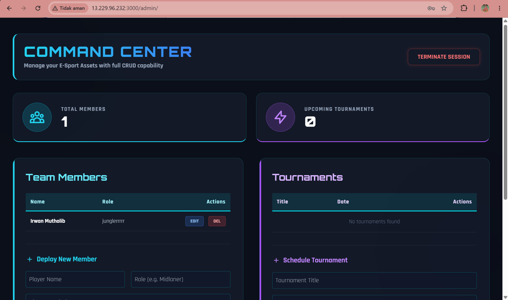

# UAS administrasi server
1. Membuat instance baru

2. membuat repo statis dan dinamis baru di docker 

3. install docker

4. pembuatan docker 

5. set repo scret

6. deploy

7. web statis

8. web dinamis
- web

- admin

