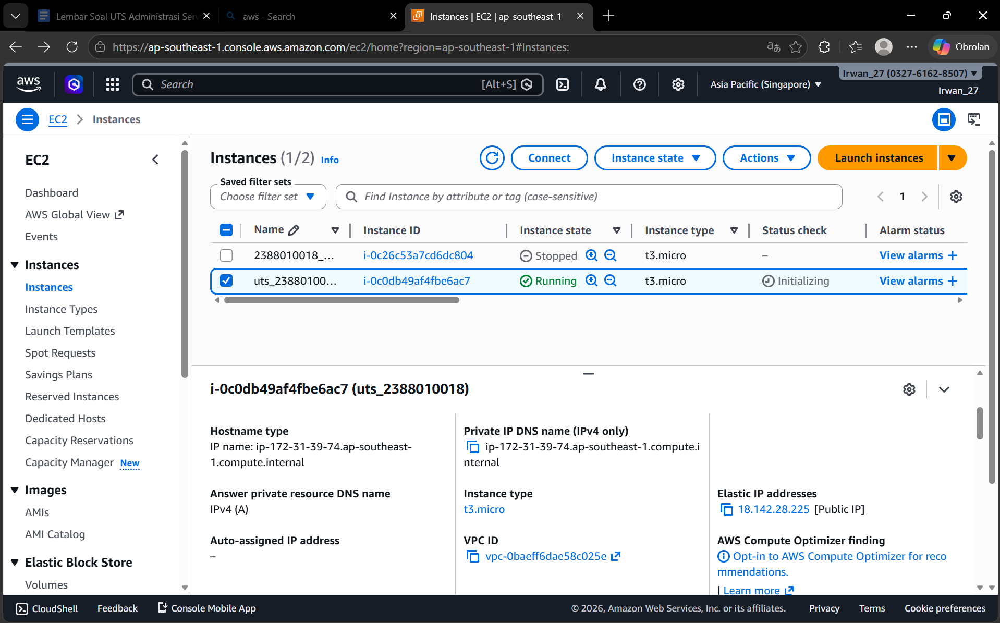
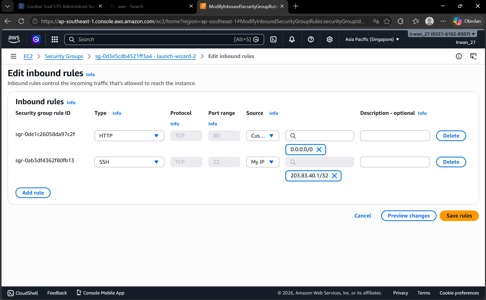
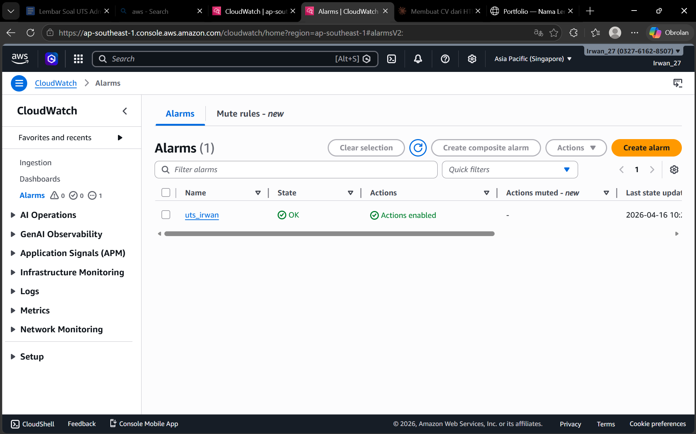
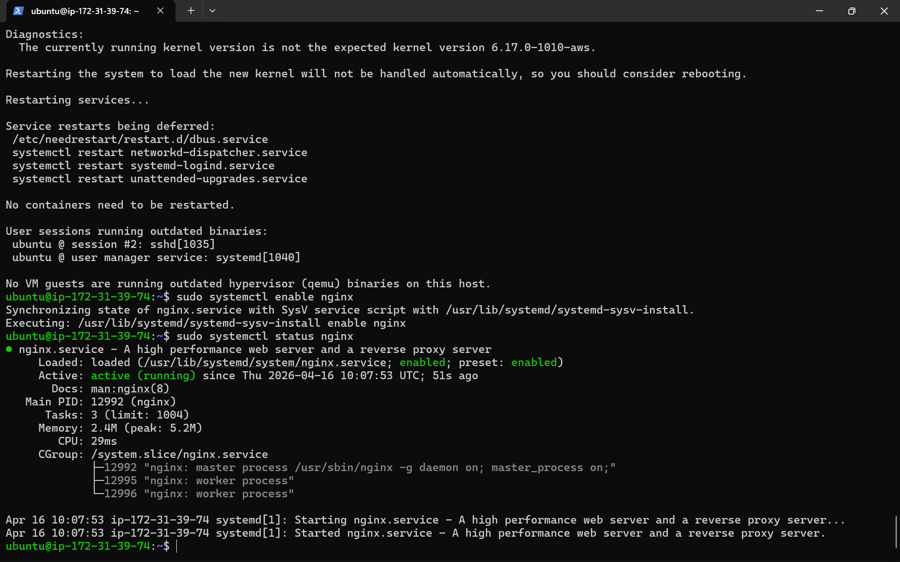

1. Buat instance EC2 sesuai spesifikasi di atas.
2. Buat Elastic IP (EIP) dan Attach (hubungkan) EIP tersebut ke instance EC2 Anda secara permanen.
3. Konfigurasi Security Group dengan ketat sesuai aturan di atas.

4. Lakukan remote login (SSH) ke dalam server Anda menggunakan PuTTY atau Terminal.
5. Lakukan instalasi web server Nginx.
6. Pastikan service Nginx berstatus running dan enabled.
