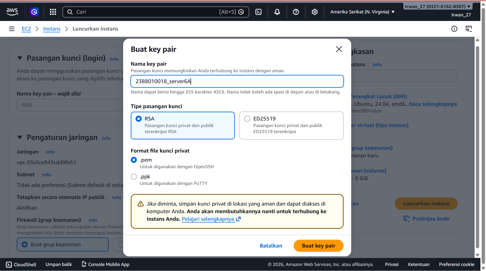
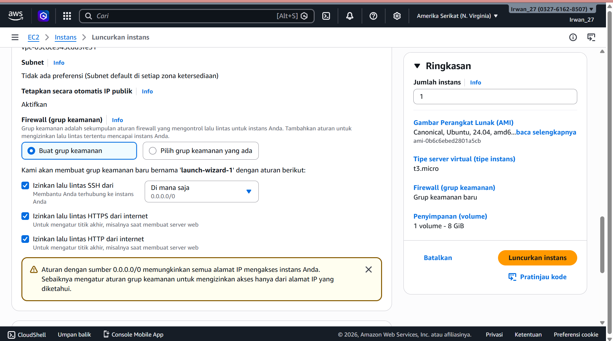
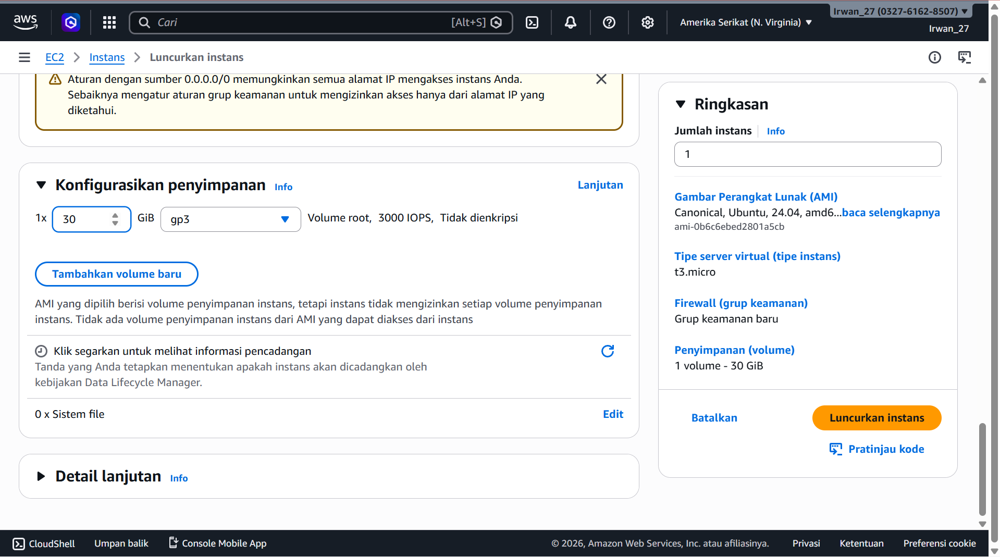
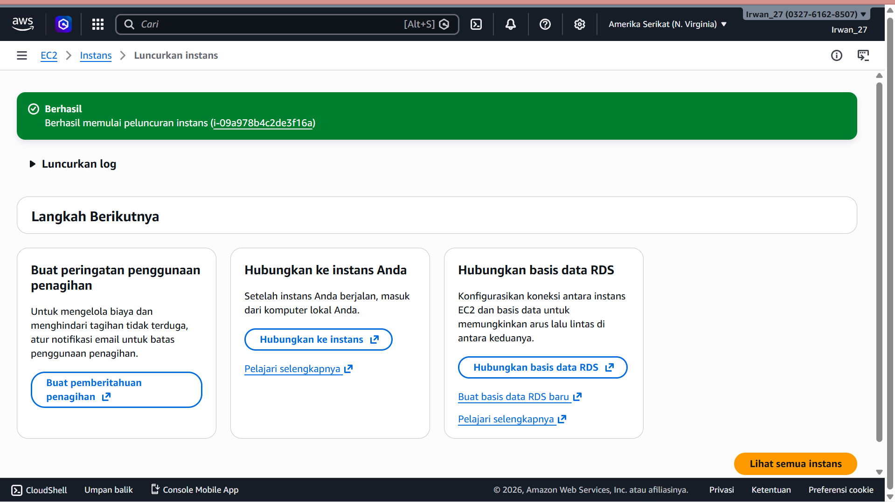
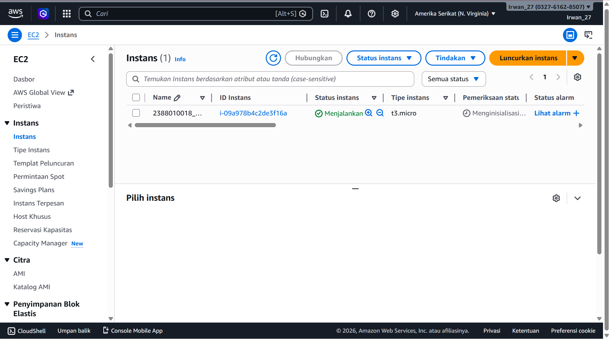

1. Search EC2
    - Instans
    - kembali lagi region ke region yng terdekat (jakarta/singapore)
2. Launch Instans
    - isi nama instans (NIM_Server6A)
    - OS Ubuntu
    - type instans(t3.micro)
3. Membuat Key pair > Create New Key > isi nama > file. pem

4. Pengaturan Jaringan (Allow semua 3 box)
    Izinkan lalu lintas SSH dari
    Izinkan lalu lintas HTTPS dari internet
    Izinkan lalu lintas HTTP dari internet
    
5. configure Storage
    1x30 gb
    
6. Luncurkan Instans
berhasil

